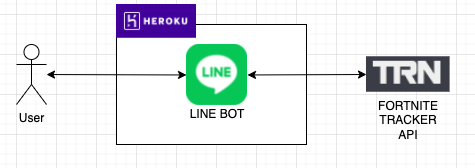

# Fortnite ビクロイカウンター LINE BOT

---
## 概要
- Fortniteのバトルロイヤルで勝利を意味するVictory Royal（ビクロイ）の数を教えます。
- Fortniteのバトルロイヤルにおけるキルレートを教えます。

---
## 利用方法

- 下記QRコードを読みこんで、友達登録してください。

- 下記のBotが表示されるので友達登録をしてください。

---
## 機能
- 友達登録完了後に下記機能が利用できます。
  - 「○○（アカウント名）のビクロイ数を教えて」と発言すると今までのVictory Royal（ビクロイ）数を返信します。
    - 「○○（アカウント名）のソロビクロイ数を教えて」と発言するとソロに絞ったVictory Royal（ビクロイ）数を返信します。
    - デュオ、トリオ、スクワッドも同様に利用できます。
  - 「○○（アカウント名）のキルレートを教えて」と発言すると今までのキルレートを返信します。
    - 「○○（アカウント名）のソロキルレートを教えて」と発言するとソロに絞ったキルレートを返信します。
    - デュオ、トリオ、スクワッドも同様に利用できます。
  
---
## 構成
- https://github.com/line/line-bot-sdk-java をベースにLINE BOTを作成しています。
- データは https://fortnitetracker.com/site-api を利用して取得しています。

